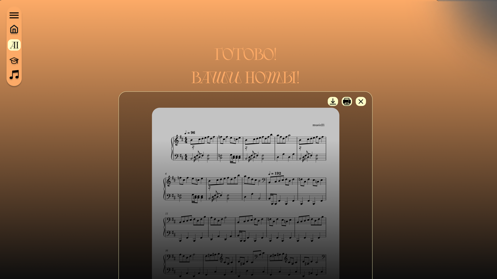
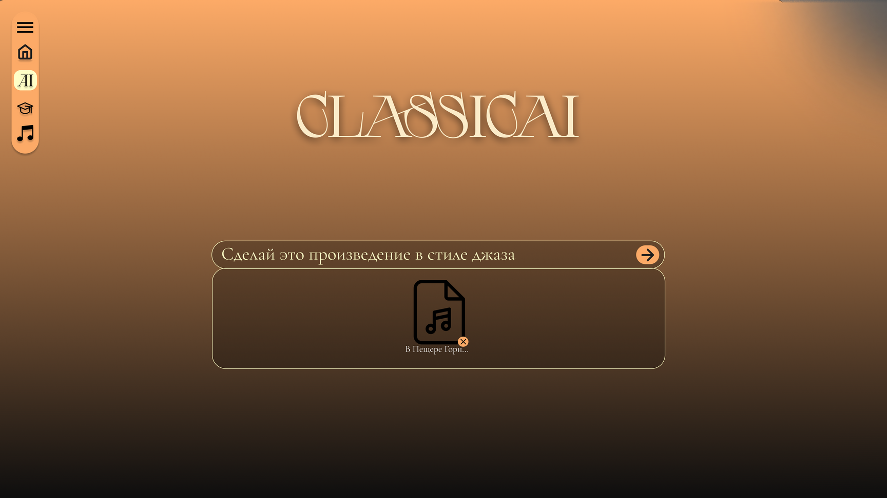
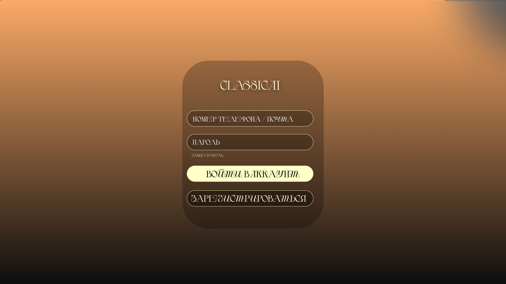
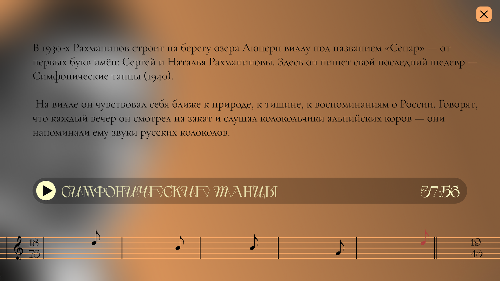
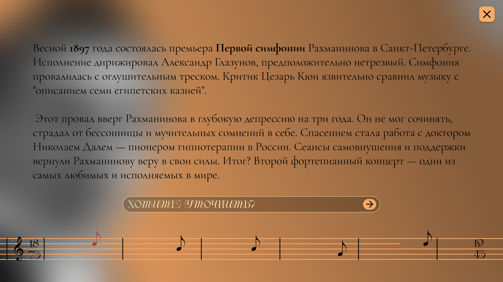
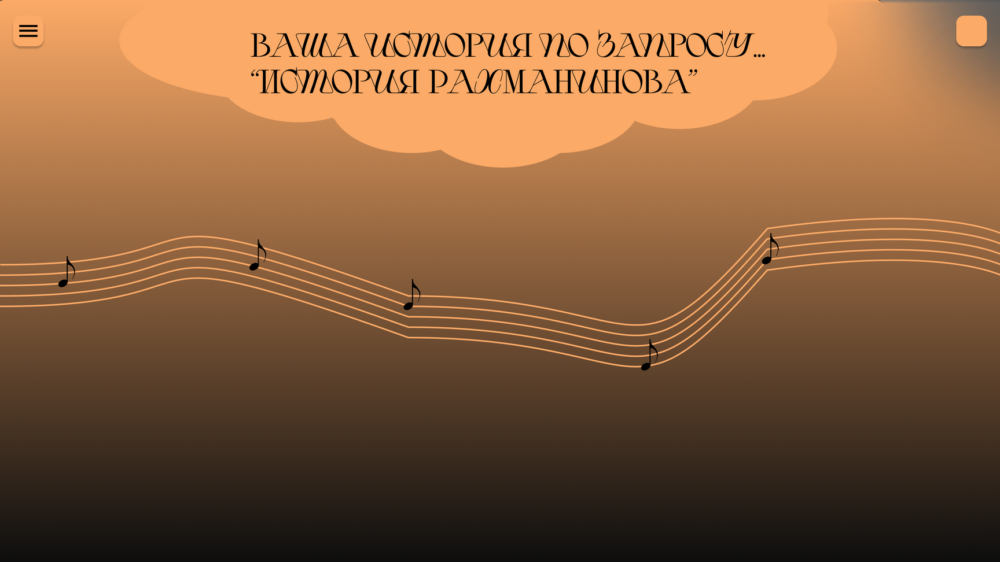
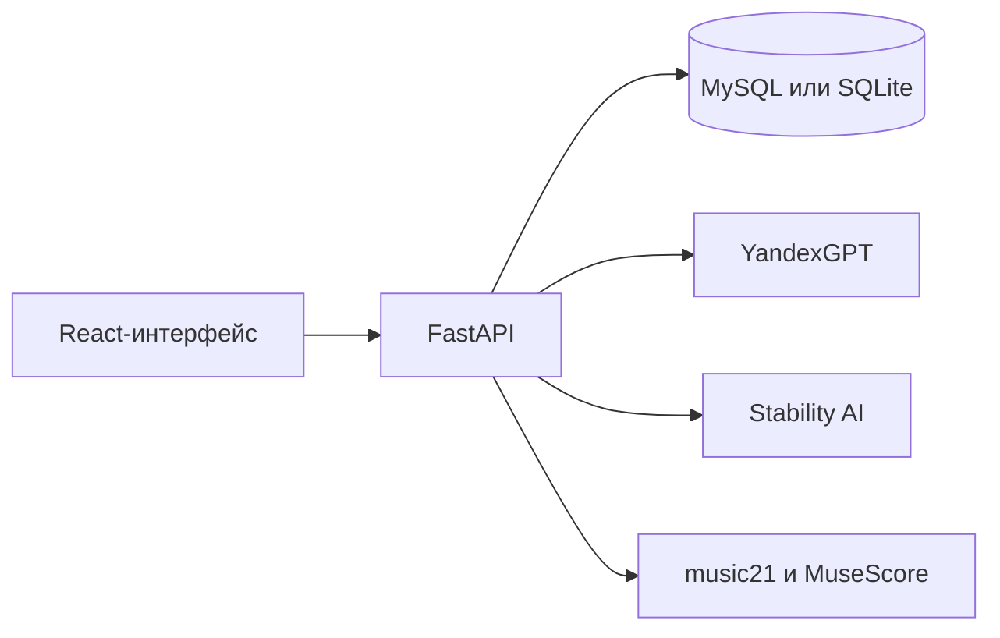

# AllegroCode · ClassicAI


**ClassicAI** — прототип образовательной веб-платформы о русской классической
музыке. Проект подготовлен для
хакатона **NeuroArt, Казань, май 2025 года**.

Платформа объединяет три сценария: разговор с ИИ о классических композиторах,
упрощение нот для начинающих и изменение стиля музыкальной записи по текстовому
описанию.

## Возможности ClassicAI

- **Чат о классических композиторах.** YandexGPT отвечает на вопросы о жизни,
  произведениях, стиле и влиянии русских композиторов.
- **Упрощение нот.** Сервис извлекает ноты из MIDI, адаптирует
  последовательность под начинающего музыканта и возвращает партитуру в PDF.
- **Изменение стиля музыки.** Пользователь загружает MP3, описывает желаемое
  звучание, а Stability AI создаёт новую версию записи.

## Интерфейс

Ниже показаны экраны трёх основных сценариев.

### Упрощение партитуры



### ИИ-композитор и преобразование аудио



## Задумка интерфейса

Эти кадры из хакатонной презентации показывают визуальную задумку и возможное
развитие ClassicAI. Они не описывают дополнительные готовые функции и не
содержат настоящих учётных данных или пользовательских файлов.









## Как устроен проект



| Часть | Технологии | Назначение |
| --- | --- | --- |
| Frontend | React, React Router, CSS Modules | Интерфейс, авторизация, загрузка файлов |
| Backend | FastAPI, SQLAlchemy, Pydantic | API, пользователи, обработка запросов |
| Музыкальный пайплайн | music21, MuseScore | MIDI → MusicXML → PDF |
| ИИ | YandexGPT, Stability AI | Справочный помощник, упрощение нот и преобразование аудио |
| Инфраструктура | Docker Compose, MySQL | Локальный запуск сервисов |

## Быстрый запуск через Docker

Понадобятся Docker Desktop и учётные данные Yandex Cloud. Ключ Stability AI
нужен только для преобразования аудио.

1. Создайте локальный файл конфигурации:

   ```powershell
   Copy-Item .env.example .env
   ```

2. Замените все значения `change-me` в `.env`. Для `JWT_SECRET` используйте
   случайную строку длиной не менее 32 символов. Например:

   ```powershell
   python -c "import secrets; print(secrets.token_urlsafe(48))"
   ```

3. Запустите приложение:

   ```powershell
   docker compose up --build
   ```

После запуска:

- frontend: `http://localhost:3000`;
- API и Swagger UI: `http://localhost:8000/docs`.

Docker Compose не публикует порт базы данных наружу. Если frontend и backend
развёрнуты на разных доменах, укажите их в `REACT_APP_API_URL` и
`CORS_ORIGINS`.

## Переменные окружения

| Переменная | Обязательна | Описание |
| --- | --- | --- |
| `JWT_SECRET` | да | Секрет подписи JWT, минимум 32 символа |
| `CORS_ORIGINS` | да | Разрешённые источники через запятую |
| `REACT_APP_API_URL` | да | Публичный адрес backend для браузера |
| `MYSQL_DATABASE` | для Docker | Имя базы MySQL |
| `MYSQL_USER` | для Docker | Пользователь MySQL |
| `MYSQL_PASSWORD` | для Docker | Пароль пользователя MySQL |
| `MYSQL_ROOT_PASSWORD` | для Docker | Пароль администратора MySQL |
| `YANDEX_FOLDER_ID` | да | Идентификатор каталога Yandex Cloud |
| `YANDEX_API_KEY` | да | Ключ доступа к YandexGPT |
| `STABILITY_API_KEY` | для аудио | Ключ Stability AI |
| `GEMINI_API_KEY` | нет | Резервная интеграция, не выбрана по умолчанию |

Настоящие ключи и пароли храните только в `.env` или в менеджере секретов.
Файл `.env` исключён из Git, а `.env.example` содержит только шаблонные значения.

## Основные API-маршруты

| Метод и путь | Назначение | Требует токен |
| --- | --- | --- |
| `POST /signup` | Регистрация | нет |
| `POST /login` | Вход и получение JWT | нет |
| `GET /userinfo` | Данные текущего пользователя | да |
| `POST /chat` | Вопрос музыкальному помощнику | да |
| `POST /simplify_music` | Преобразование MIDI в упрощённый PDF | да |
| `POST /upload-audio` | Преобразование MP3 по описанию | да |


## Ограничения прототипа

- Это хакатонная версия, а не готовый production-сервис.
- Качество упрощения MIDI зависит от исходного файла и ответа языковой модели.
- Для генерации PDF контейнеру нужен MuseScore.
- Перед production-развёртыванием нужны HTTPS, ограничение частоты запросов,
  миграции базы данных и отдельное хранилище секретов.

## Структура репозитория

```text
AllegroCode/
├── Backend/            # FastAPI и музыкальные пайплайны
├── Frontend/           # React-приложение
├── docs/images/        # Обезличенные изображения для README
├── .env.example        # Безопасный шаблон конфигурации
├── docker-compose.yml
├── Dockerfile.backend
└── Dockerfile.frontend
```
